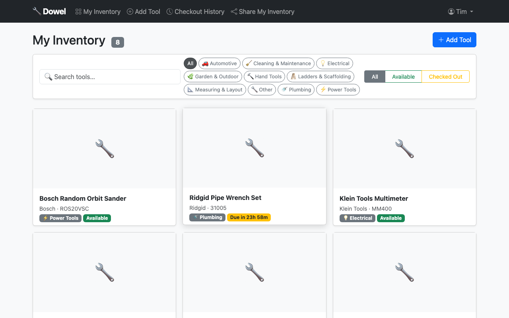
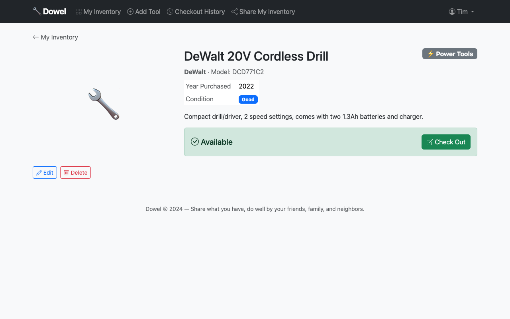
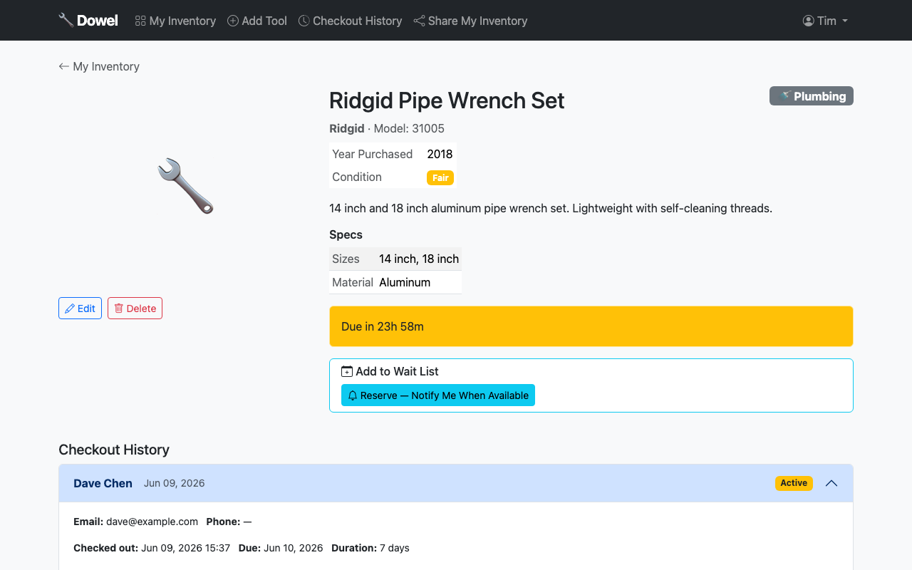
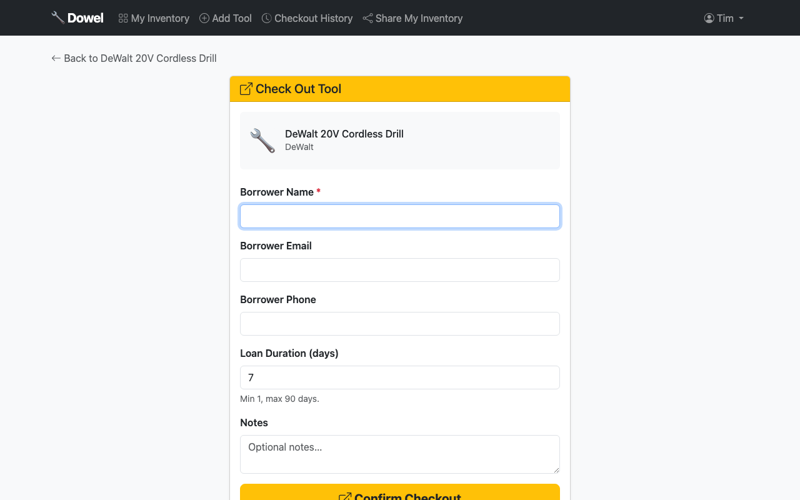
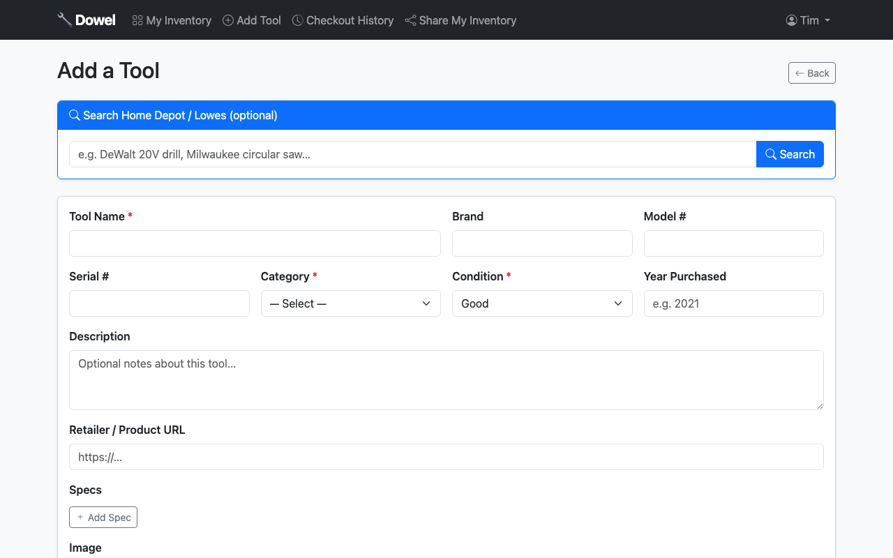

# Dowel 🔧

> *A dowel is one of the most humble pieces in a workshop — a small wooden peg that joins things together and holds them in place. That's exactly what this app is meant to do.*

**Dowel** carries a dual meaning:

- **Dowel** — the basic connecting piece. A simple, unassuming tool that brings two things together and makes them stronger. Just like sharing tools brings neighbors, friends, and family closer.
- **Do-Well** — because lending what you have to someone who needs it is simply the right thing to do. Do well by the people around you.

---

## What is Dowel?

Dowel is a community tool lending library — built for families, friends, neighbors, and anyone who believes that sharing is better than buying. Think of it like your local public library, but for the drill press in your garage and the pipe wrench in your shed.

- Catalog your tools with photos, specs, and details
- Auto-populate tool info from Home Depot or Lowes
- Check tools in and out with a built-in library system (7-day default)
- Live countdown timers show exactly how long until a tool is due back
- Reservation queue so nobody misses out
- Share your inventory with a public link — no account required to browse or request

No fees. No transactions. Just friends, family, and neighbors helping each other do well.

---

## Screenshots

**Inventory Dashboard** — browse, search, and filter your tools with live availability badges



**Tool Detail — Available** — full specs, condition, and one-click checkout



**Tool Detail — Checked Out** — live countdown showing time remaining



**Checkout Form** — log who borrowed it, for how long, and any notes



**Add a Tool** — search Home Depot / Lowes to auto-fill, or enter manually



---

## Features

- 🔐 **Multi-user accounts** — each user manages their own inventory
- 🛠 **Tool catalog** — name, brand, model, serial number, condition, specs, photos
- 🏪 **Retailer lookup** — auto-fill tool data and images from Home Depot / Lowes
- 📸 **Image uploads** — upload your own photo, resized and stored automatically
- 📦 **Checkout system** — borrow tracking with configurable duration (1–90 days, default 7)
- ⏱ **Live countdowns** — dynamic badges show time remaining or overdue status
- 🔖 **Reservations** — queue up for a tool that's currently checked out
- 🔗 **Public share link** — shareable read-only inventory page per user
- 🗂 **Categories** — Power Tools, Hand Tools, Garden, Plumbing, Electrical, Automotive, and more
- 🔍 **Search & filter** — live search by name, filter by category and availability

---

## Tech Stack

| Layer | Technology |
|---|---|
| Backend | Python / Flask |
| Database | SQLite (dev) / PostgreSQL (production) |
| ORM | SQLAlchemy |
| Auth | Flask-Login + Flask-Bcrypt |
| Forms | Flask-WTF / WTForms |
| Frontend | Bootstrap 5 + Vanilla JS |
| Images | Pillow |
| Retailer Lookup | Requests + BeautifulSoup4 |

---

## Getting Started

### Prerequisites
- Python 3.10+ (3.12 recommended)
- pip

### Installation

```bash
# Clone the repo
git clone https://github.com/molemantis/dowel.git
cd dowel

# Create and activate virtual environment
python3 -m venv venv
source venv/bin/activate  # Windows: venv\Scripts\activate

# Install dependencies
pip install -r requirements.txt

# Set up environment variables
cp .env.example .env
# Edit .env and set your SECRET_KEY

# Run the app
python run.py
```

The app will be available at `http://localhost:5002`. Categories are seeded automatically on first run.

### Environment Variables

```env
SECRET_KEY=your-secret-key-here
DATABASE_URL=sqlite:///dowel.db        # or postgres://... for production
MAX_CONTENT_LENGTH=16777216            # 16MB max upload
UPLOAD_FOLDER=app/static/uploads
```

---

## Project Structure

```
dowel/
├── app/
│   ├── __init__.py          # App factory
│   ├── models.py            # Database models
│   ├── config.py            # Configuration
│   ├── auth/                # Login, register, logout
│   ├── tools/               # Tool catalog + public share
│   ├── lending/             # Checkout, return, reservations
│   ├── lookup/              # Retailer product lookup service
│   ├── templates/           # Jinja2 HTML templates
│   └── static/              # CSS, JS, uploaded images
├── run.py                   # Entry point + DB seed
├── requirements.txt
└── .env.example
```

---

## Roadmap

- [ ] **Retailer product lookup** — search by model number to auto-fill tool details and images from Home Depot, Lowes, and Amazon
- [ ] Email notifications when a reserved tool becomes available
- [ ] Push notifications for overdue checkouts
- [ ] Mobile-first PWA support
- [ ] Groups / circles (family group, neighborhood group)
- [ ] Damage reporting and condition tracking
- [ ] Barcode / QR code scanning for quick checkout
- [ ] PostgreSQL + deployment guide (Render / Railway / Fly.io)

---

## Philosophy

Most tool-sharing apps are rental marketplaces. Dowel is not. There are no transactions, no peer ratings for profit, no strangers. This is built for the circle of people you already trust — the ones you'd lend your good drill to without a second thought.

The name says it all. A dowel doesn't do anything flashy. It just quietly holds things together.

**Do well. Share what you have.**

---

## License

MIT — free to use, fork, and share. Just like a good neighbor would.
